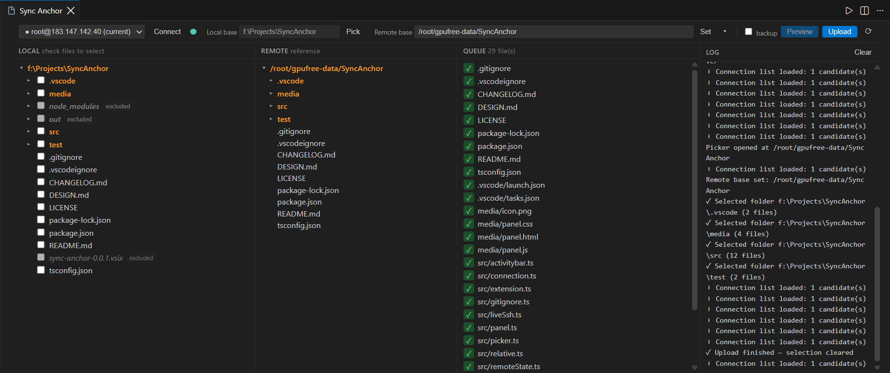

<div align="center">


# **Sync Anchor**

**Copy selected local files to Remote Server just on your VSCode.**

*The local-edit → remote-run workflow for AI Coding Agents: Agents change files on your machine, Sync Anchor pushes the exact selection to the server where tests, training, and GPU jobs run.*

<p>

[](LICENSE)
[](https://code.visualstudio.com/)
[](https://nodejs.org/)
[](https://www.typescriptlang.org/)
[](https://github.com/DonaldTrump-coder/SyncAnchor)
[](https://www.npmjs.com/package/ssh2)
[](https://github.com/DonaldTrump-coder/SyncAnchor)

</p>

</div>

---

## Usage of the Extension

1. Click the **Sync Anchor** icon in the Activity Bar (or run `Sync Anchor: Open Panel`).
2. Pick a connection to copy files for (only **live** SSH sessions are listed).
3. Set the **local base** (a folder on your lical machine) and the **remote base** (a folder on the server).
4. Check files/folders in the local tree, select for a batch, and then click **Preview**.
5. Review the transfer queue (new / overwrite / skip), then **Upload**.



## Configurations

| Setting | Default | Description |
|---|---|---|
| `syncAnchor.excludes` | `[".git"]` | Glob-like patterns excluded from the tree and uploads. Entries matching the local base's `.gitignore` are excluded too. |
| `syncAnchor.backupBeforeOverwrite` | `false` | Move remote files to `~/.sync-anchor-backup/<timestamp>/` before overwriting. |

## From Source

**Prerequisites**

- A remote host reachable over SSH, with an entry in `~/.ssh/config` (or a Remote-SSH recent connection)
- Node.js 18+

**Build & run**

```bash
npm install
npm run compile      # tsc → out/
npm test             # engine + webview (jsdom) suites, 124 assertions
npm run package      # build the .vsix
```

Run the extension with **F5** inside VS Code (launch.json is included).

## Release Notes

See [CHANGELOG.md](CHANGELOG.md).

## License

MIT
